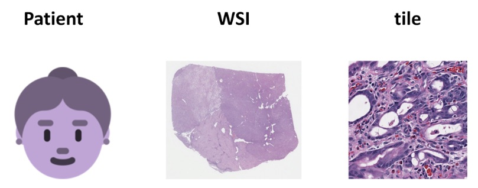

# DeepHistology
This is a pan-cancer platform for mutation prediction from routine histology by the Kather lab (http://kather.ai). It is implemented in MATLAB and requires version R2019a+ (for some types of visualization, R2019b+). The following Matlab toolboxes are required: Image processing toolbox, Deep learning toolbox, Parallel processing toolbox.

Briefly, to use these scripts, you should
1. prepare your data according to the Aachen protocol as described here: https://zenodo.org/record/3694994 
2. prepare an "experiment file" which specifies the name of the project, the location of the tiles and the targets to be predicted
3. run autoDeepLearn('experiment','<your experiment name>') to run a cross-validated experiment
4. visualize the results with autoVisualize('experiment','<your experiment name>')

An example for a possible data structure (project TCGA-CRC-DX) is:
- experiment file 'tcga-crc-generated' is located in './experiments'
- CLINI table 'TCGA-CRC-DX_CLINI.xlsx' is located in './cliniData' and has a column called PATIENT
- SLIDE table 'TCGA-CRC-DX_SLIDE.csv' is located in './cliniData' and has a column called PATIENT and a column called FILENAME
- image tiles were generated with QuPath, are named according to the Aachen protocol and are located at 'E:/TCGA-CRC-DX/BLOCKS/' 

## Releases

This project is constantly evolving and is being updated regularly. To reproduce our previous research findings, you can use "frozen" releases of the code. 

- v0.2 was used for the project "Pan-cancer image-based detection of clinically actionable genetic alterations"

more info: https://github.com/jnkather/DeepHistology/releases 

## Main scripts and their input arguments

### autoDeepLearn

This is the main function for training networks and to evaluate networks via cross-validation. 

Argument | Default Value | Description
--- | --- | ---
experiment | '' |  which experiment to load
gpuDev     | 1 | GPU Device (1 or greater)
maxBlockNum | 1000 | number of  (tiles) per whole slide image
trainFull | false | train on full dataset after xval
modelTemplate | shufflenet512 | which pretrained model, possible options are defined in getAndModifyNet()
backwards | false | for each experiment, work backwards in the list of targets
binarizeQuantile | [] | split high/low at this quantile, possible options: floating point number between 0 and 0.5 or empty (use mean)
foldxval | 3 | if cross validation is used, this is the fold, possible option: any positive integer. If this is 0, no cross validation will be done. 
aggregateMode | majority | how to pool block predictions per patient, possible otions: 'majority', 'mean' or 'max'
saveTileTable | false | save a table for all tile predictions for visualization in QuPath
tableModeClini | XLSX | file format of clinical table, XLSX or CSV
hyper | default | set of hyperparameters as defined in getDeepHyperparameters(), possible options: default, lowresource or verylowresource
valSet | [] | validation set proportion of training set to stop training early
filterBlocks |  | can be 'normalized' or 'stroma' or 'tumor' for specific training tasks. Default: empty.
subsetTargetsBy | [] | subset the patients by a variable
subsetTargetsLevel | [] | subset the patients by this level in the variable
skipExistingTargets | false |  skip target prediction if result file exists
forgiveError | false | ignore errors during training and go on to the next task

### autoDeploy

This function will use a trained network and allows to deploy it on a different patient cohort. 

Argument | Default Value | Description
--- | --- | ---
trainedModelID | [] | use a previously trained model for deployment
trainedModelFolder | [] |  path to previously trained model for deployment
    
### autoVisualize

This function will load results from the 'DUMP' folder and create plots.

Argument | Default Value | Description
--- | --- | ---
doPlot | false | show the ROC curve on screen
doPrint | false |  save the ROC to PDF and Imgs to PNG
plotThreshold  | false | plot the operating threshold on top
exportBlockPred | false |  save CSV file for maps
exportTopTiles | 0 | save top tiles
topPatients | 3 |  showcase tiles from these patients
plotFontSize | 12 |  font size for plots    
saveFormat | v6  | version of results file (debug only)   
plotAUCthreshold | 0.75 |  detailed visualization only for high performance targets
onlyExplicitTargets | true |  visualize only targets specified in experiment file
debugMode | false |  debug mode

## License
See separate License file which applies to all files within this repository unless noted otherwise. Please note that some functions in the subroutine folder are from third party sources and have their own license included in the file. 

## Questions?
Get in touch at https://jnkather.github.io/contact/